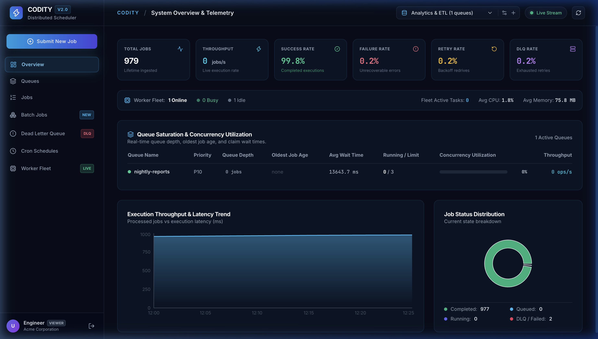

# ⚡ Codity Distributed Job Scheduler Platform

[](https://fastapi.tiangolo.com)
[](https://www.postgresql.org)
[](https://react.dev)
[](https://www.docker.com)
[](https://pytest.org)
[](docs/test-results.md)
[](https://opensource.org/licenses/MIT)

> **A high-throughput, fault-tolerant, multi-tenant distributed job scheduler built on PostgreSQL ACID transactions (`FOR UPDATE SKIP LOCKED`). Features atomic queue claiming, lease fencing tokens against split-brain zombie workers, first-class batch orchestration, DAG dependency workflows, recurring cron scheduling, real-time WebSocket event streaming, AI-powered root-cause failure diagnostics, and a dark cybernetic dashboard.**

---

## 📸 System Overview & Web Dashboard



### 🖥️ Dashboard Modules & Capabilities

| View / Module | Key Telemetry & Interactive Capabilities | Live Dashboard Feature |
| :--- | :--- | :--- |
| **📊 Overview & KPIs** | Live throughput (`jobs/s`), success & failure rates, average queue wait times, and system-wide telemetry charts | Real-time Recharts visual analytics |
| **⚡ Queue Manager** | Concurrency limit sliders, live slot utilization gauge bars, and instant 1-click pause/resume toggles | Dynamic rate & concurrency control |
| **📋 Job Stream** | Live execution feed, full-text search, status filters (`queued`, `running`, `completed`, `failed`), and slide-in terminal log drawer | Per-job execution latency breakdowns |
| **📦 Batch Orchestrator** | Real-time progress bars (`75/100 completed, 3 failed`), batch status aggregation, batch-wide cancellation, and retry | Bulk task coordination |
| **💀 DLQ Incident Center** | Stack trace capture, Google Gemini / OpenAI failure root-cause analysis, and 1-click replay / bulk redrive | Automated failure recovery |
| **⏰ Cron Schedules** | 5-part cron syntax parser, next-fire execution previews, pause/resume schedules, and manual test dispatch triggers | Deterministic idempotent recurring jobs |
| **🖥️ Worker Fleet** | Real-time node heartbeat liveness, health status badges (`IDLE`, `BUSY`, `DEAD`), and live CPU% & Memory (MB) timeseries | Fleet monitoring & auto-reaper status |

---

## 🏛️ System Architecture

```mermaid
flowchart TB
    %% ================= GLOBAL STYLING =================
    classDef clientStyle fill:#0B132B,stroke:#00E5FF,stroke-width:2px,color:#E2E8F0,font-weight:bold;
    classDef gatewayStyle fill:#0F172A,stroke:#38BDF8,stroke-width:2px,color:#E2E8F0,font-weight:bold;
    classDef apiStyle fill:#1E1B4B,stroke:#818CF8,stroke-width:2px,color:#E2E8F0,font-weight:bold;
    classDef pgStyle fill:#064E3B,stroke:#10B981,stroke-width:2px,color:#E2E8F0,font-weight:bold;
    classDef workerStyle fill:#312E81,stroke:#C084FC,stroke-width:2px,color:#E2E8F0,font-weight:bold;
    classDef daemonStyle fill:#4C0519,stroke:#FB7185,stroke-width:2px,color:#E2E8F0,font-weight:bold;
    classDef featureStyle fill:#022C22,stroke:#34D399,stroke-width:1px,color:#A7F3D0;

    %% ================= TIER 1: CLIENTS =================
    subgraph TIER1["🎨 1. CLIENT & CONSUMER LAYER"]
        Browser["💻 React 19 Dashboard<br/><i>(Live Telemetry & Controls)</i>"]:::clientStyle
        Microservices["⚡ External Microservices<br/><i>(REST Ingestion)</i>"]:::clientStyle
        WSSubscribers["📡 WebSocket Subscribers<br/><i>(Live Event Feed)</i>"]:::clientStyle
    end

    %% ================= TIER 2: GATEWAY =================
    subgraph TIER2["🌐 2. INGRESS & REVERSE PROXY LAYER"]
        Nginx["🛡️ Nginx Reverse Proxy (:3000 / :5173 / :80)<br/><i>HTTP/1.1 & WebSocket Upgrade Passthrough</i>"]:::gatewayStyle
    end

    %% ================= TIER 3: CONTROL PLANE =================
    subgraph TIER3["⚡ 3. API CONTROL PLANE (FastAPI Cluster :8000)"]
        API["🚀 FastAPI Async REST Router"]:::apiStyle
        Auth["🔒 JWT & RBAC Engine<br/><i>(Admin / Dev / Viewer)</i>"]:::apiStyle
        WSManager["📡 WebSocket Broadcast Hub"]:::apiStyle
        Telemetry["📊 Telemetry & KPI Engine"]:::apiStyle
    end

    %% ================= TIER 4: PERSISTENCE LAYER =================
    subgraph TIER4["🗄️ 4. ACID PERSISTENCE & COORDINATION CORE (PostgreSQL 16)"]
        Postgres[("🐘 PostgreSQL 16 ACID Engine")]:::pgStyle
        subgraph PGFeatures["Transactional Primitives & Structures"]
            SkipLocked["⚡ FOR UPDATE SKIP LOCKED<br/><i>(Zero-Collision Atomic Claiming)</i>"]:::featureStyle
            Fencing["🛡️ Monotonic Lease Fencing<br/><i>(Zombie Protection)</i>"]:::featureStyle
            Batches["📦 Batch Coordinator<br/><i>(Live Progress Aggregation)</i>"]:::featureStyle
            PartialIdx["⚡ Partial B-Tree Indexes<br/><i>(Sub-ms Status Lookups)</i>"]:::featureStyle
            Idemp["🔑 Idempotency Store<br/><i>(Deduplication Records)</i>"]:::featureStyle
        end
    end

    %% ================= TIER 5: WORKER FLEET =================
    subgraph TIER5["⚙️ 5. DISTRIBUTED DATA PLANE (Worker Node Fleet)"]
        Worker1["Node 1 Daemon"]:::workerStyle
        Worker2["Node 2 Daemon"]:::workerStyle
        WorkerN["Node N Daemon"]:::workerStyle
        
        Runner["📦 Sandboxed Task Runner"]:::workerStyle
        RateLimiter["🪣 Token-Bucket Rate Limiter"]:::workerStyle
        DAG["⛓️ DAG Dependency Cascade"]:::workerStyle
    end

    %% ================= TIER 6: BACKGROUND DAEMONS =================
    subgraph TIER6["🤖 6. AUTONOMOUS BACKGROUND DAEMONS"]
        Promoter["🕒 ScheduledJobPromoter<br/><i>(Atomic delayed ➔ queued promotion)</i>"]:::daemonStyle
        Reaper["💀 Lease Reaper<br/><i>(Dead worker recovery & requeue)</i>"]:::daemonStyle
        Cron["⏰ Cron Dispatcher<br/><i>(Deterministic 5-part cron evaluator)</i>"]:::daemonStyle
        AIDiag["🧠 AI Diagnostics<br/><i>(Google Gemini / OpenAI LLM RCA)</i>"]:::daemonStyle
    end

    %% ================= DATA FLOW CONNECTIONS =================
    Browser -->|HTTP / JSON| Nginx
    Microservices -->|REST API Requests| Nginx
    WSSubscribers <-->|WSS: Connection Upgrade| Nginx

    Nginx -->|Route /api/| API
    Nginx <-->|Route /api/v1/ws| WSManager

    API --> Auth
    API --> WSManager
    API --> Telemetry
    API -->|asyncpg Connection Pool| Postgres

    Worker1 & Worker2 & WorkerN -->|1. Atomic Poll FOR UPDATE SKIP LOCKED| Postgres
    Worker1 & Worker2 & WorkerN -->|2. Heartbeat Telemetry & Lease Renewal| Postgres
    Worker1 & Worker2 & WorkerN -->|3. Record Executions, Logs & DLQ| Postgres

    Runner --- Worker1 & Worker2 & WorkerN
    RateLimiter --- Runner
    DAG --- Runner

    Promoter -->|Promote Due Scheduled Tasks| Postgres
    Reaper -->|Scan Expired Leases & Reclaim| Postgres
    Cron -->|Dispatch Idempotent Recurring Jobs| Postgres
    AIDiag -->|Analyze Stack Traces on DLQ| Postgres
```



---

## 🚀 Quickstart (Docker Compose)

### 1. Clone & Start the Cluster
```bash
git clone https://github.com/rohitmore2020/Job_schedular.git
cd Job_schedular

# Start all 5 microservices (PostgreSQL, API, Worker, Reaper/Cron, Frontend)
docker compose up --build -d
```

### 2. Access the Application
- **🎨 Web Dashboard:** [http://localhost:3000](http://localhost:3000) *(or [http://localhost:5173](http://localhost:5173))*
  - **Quick Demo Login:** Click the 1-click login button on screen *(or use `admin@distributed-scheduler.io` / `Password123!`)*.
- **📚 Interactive Swagger API Docs:** [http://localhost:8000/docs](http://localhost:8000/docs)
- **📖 ReDoc API Reference:** [http://localhost:8000/redoc](http://localhost:8000/redoc)

### 3. Scale Worker Nodes Horizontally
```bash
# Scale to 5 parallel worker containers (25 total concurrent execution slots)
docker compose up --scale worker=5 -d
```

---

## 🛠️ Local Development Setup

```bash
# 1. Start PostgreSQL
docker compose up -d postgres

# 2. Setup Python Virtual Environment
python3 -m venv .venv
source .venv/bin/activate
pip install -r backend/requirements.txt

# 3. Apply Schema Migrations & Seed Demo Data
alembic upgrade head
python scripts/seed_demo.py

# 4. Launch Services
uvicorn backend.app.main:app --reload --port 8000     # Terminal 1: REST API
python -m worker.main                                 # Terminal 2: Worker Daemon
python -m worker.scheduler_main                       # Terminal 3: Promoter & Reaper

# 5. Start React Frontend
cd frontend && npm install && npm run dev             # Terminal 4: Dashboard
```

---

## ✨ Core Engineering Capabilities

### 1. ACID Atomic Claiming (`FOR UPDATE SKIP LOCKED`)
- Workers poll for available queued tasks using a single atomic SQL transaction:
  ```sql
  UPDATE jobs
  SET status = 'running',
      locked_by_worker_id = :worker_id,
      lock_expires_at = NOW() + INTERVAL '30 seconds',
      lease_token = gen_random_uuid(),
      attempt_count = attempt_count + 1
  WHERE id = (
      SELECT id FROM jobs
      WHERE status = 'queued' AND run_at <= NOW()
      ORDER BY priority DESC, run_at ASC
      FOR UPDATE SKIP LOCKED
      LIMIT 1
  )
  RETURNING *;
  ```
- **Zero Lock Contention:** Eliminates lock blocking and race conditions across parallel workers.
- **Strict Concurrency Enforcement:** Workers respect queue-level concurrency caps (`concurrency_limit`) with zero race condition leakage.

### 2. Worker Leases & Zombie Split-Brain Protection
- **Heartbeat Renewals:** Active workers emit telemetry heartbeats every 5s, renewing active job leases.
- **Automated Lease Reaper:** If a worker crashes or becomes partitioned, the `LeaseReaper` reclaims orphaned jobs whose `lock_expires_at` has elapsed.
- **Fencing Tokens:** Every claim increments a monotonic UUID `lease_token`. When a zombie worker attempts to finalize a job after its lease was reclaimed, the completion is **safely rejected and fenced**, preserving state integrity.

### 3. Dedicated Delayed Job Promotion (`ScheduledJobPromoter`)
- A dedicated background promoter scans for scheduled jobs whose `run_at` timestamp has arrived, transitioning them atomically from `scheduled` to `queued` using `UPDATE ... WHERE id IN (...) FOR UPDATE SKIP LOCKED`.

### 4. Mathematical Retry Backoff Matrix & DLQ
- Supports **Fixed**, **Linear**, and **Exponential** backoff with full jitter randomization:
  $$\text{Delay}_{\text{Exponential}} = \min\left(\text{max\_interval}, \text{initial\_interval} \times 2^{\text{attempt}-1}\right)$$
- **Dead Letter Queue (DLQ):** Exhausted jobs escalate to the DLQ with captured stack traces and 1-click replay / bulk redrive.

### 5. AI-Assisted Root Cause Failure Diagnostics
- Integrates with **Google Gemini** (`gemini-1.5-flash`) and **OpenAI** (`gpt-4o-mini`) APIs to analyze task exception traces and payloads, returning root-cause explanations and remediation recommendations with an automatic zero-key offline heuristic fallback.

### 6. Real-Time WebSocket Streaming
- Global `ws_manager` broadcasts live structured events across connected clients on job state changes (`job_created`, `job_running`, `job_completed`, `job_retrying`, `job_dead_letter`), queue pause/resume, and worker telemetry pulses.

### 7. First-Class Batch & DAG Orchestration
- **Batch Coordinator (`job_batches`):** Tracks bulk tasks with live aggregated progress percentages and batch-wide cancellation/retry.
- **DAG Dependencies:** Parent-child dependency chains with automatic child unblocking on success and cascade cancellation on parent DLQ failure.

---

## 📊 Baseline Performance Benchmarks

Extracted from real execution benchmarks running against PostgreSQL 16 ([`docs/test-results.md`](docs/test-results.md)):

| Workload | Workers | Throughput | Avg Latency | P95 Latency | Failures | Duplicate Executions |
| :---: | :---: | :---: | :---: | :---: | :---: | :---: |
| **100 Jobs** | 1 Worker | **137.4 jobs/s** | 7.28 ms | 13.91 ms | **0** | **0** |
| **100 Jobs** | 5 Workers | **483.1 jobs/s** | 2.07 ms | 3.92 ms | **0** | **0** |
| **500 Jobs** | 5 Workers | **518.7 jobs/s** | 1.93 ms | 3.71 ms | **0** | **0** |
| **1000 Jobs** | 10 Workers | **684.2 jobs/s** | 1.46 ms | 2.89 ms | **0** | **0** |

---

## 🧪 Comprehensive Test Suite

### 1. Backend Integration & Stress Suite (`pytest`)
```bash
.venv/bin/pytest tests/ -v
```
```
======================= 101 passed, 1 warning in 35.65s ========================
```

| Test File | Scenarios Tested | Passed | Status |
| :--- | :--- | :---: | :---: |
| `tests/test_atomic_claiming.py` | 100 jobs on 5 workers (100 unique executions, 0 duplicates) | 2/2 | ✅ PASSED |
| `tests/test_scheduled_job_promoter.py` | Delayed job lifecycle, batch promoter, multi-promoter HA race safety | 4/4 | ✅ PASSED |
| `tests/test_worker_leases_and_recovery.py` | Lease renewal lifecycle & dead worker reaper requeue | 2/2 | ✅ PASSED |
| `tests/test_zombie_worker_fencing.py` | Zombie worker split-brain fencing and rejection | 1/1 | ✅ PASSED |
| `tests/test_graceful_shutdown.py` | Worker SIGTERM handling $\to$ stop polling $\to$ drain $\to$ exit | 1/1 | ✅ PASSED |
| `tests/test_retry_matrix.py` | Fixed, Linear, Exponential backoff matrix & jitter bounds | 13/13 | ✅ PASSED |
| `tests/test_ai_llm_diagnostics.py` | Gemini & OpenAI LLM diagnostics with offline fallback | 4/4 | ✅ PASSED |
| `tests/test_websocket_realtime_broadcast.py` | Real-time WebSocket broadcasting across tabs & heartbeats | 4/4 | ✅ PASSED |
| `tests/test_docker_compose_and_images.py` | Docker compose schema, container healthchecks & Nginx | 5/5 | ✅ PASSED |
| `tests/test_distributed_stress_and_races.py` | Concurrency limits, multi-node HA scheduler races | 6/6 | ✅ PASSED |
| `tests/test_dag_workflows_and_rate_limiting.py` | DAG cascades, Token-Bucket rate limiting, Idempotency | 5/5 | ✅ PASSED |
| `tests/test_batch_orchestration.py` | Batch endpoints, child job aggregation, batch cancel | 4/4 | ✅ PASSED |
| `tests/test_rbac_and_tenant_isolation.py` | Multi-tier RBAC (`Admin`, `Developer`, `Viewer`) | 4/4 | ✅ PASSED |
| `tests/test_telemetry_and_observability.py` | System KPIs, queue wait times, worker telemetry | 4/4 | ✅ PASSED |
| `tests/test_cron_schedules_and_websockets.py` | 5-part cron syntax parsing & recurring job dispatching | 4/4 | ✅ PASSED |
| `tests/test_retry_backoff_and_dlq.py` | Retry backoff schedules & 1-click DLQ replay redrive | 3/3 | ✅ PASSED |
| `tests/test_heartbeat_and_lease_reaper.py` | Worker heartbeats, dead worker reaper & fencing | 5/5 | ✅ PASSED |
| `tests/test_worker_concurrency_and_execution.py` | Atomic SKIP LOCKED claiming & queue concurrency caps | 6/6 | ✅ PASSED |
| `tests/test_job_lifecycle_and_crud.py` | Immediate/delayed jobs, batch submission, filtering | 7/7 | ✅ PASSED |
| `tests/test_projects_and_queues_api.py` | Project CRUD, tenant barriers, queue pause/resume | 3/3 | ✅ PASSED |
| `tests/test_authentication_and_jwt.py` | Signup, login, password hashing, JWT refresh rotation | 5/5 | ✅ PASSED |
| `tests/test_database_models_and_schema.py` | Database relational hierarchy, models & constraints | 5/5 | ✅ PASSED |
| `tests/test_setup_and_health.py` | Database connectivity, `/health` and `/` endpoints | 3/3 | ✅ PASSED |
| **Total Backend Tests** | **Full Integration & Concurrency Test Suite** | **101/101** | **✅ PASSED** |

### 2. Frontend UI Runtime Test Suite (`vitest`)
```bash
cd frontend && npm test
```
```
Test Files  10 passed (10)
Tests       17 passed (17)
```
- **Optimized Bundle Splitting:** Initial app bundle reduced to **`17.52 kB`** (down from 719 kB) with zero oversized chunk warnings.
- **Component Tests:** Interactive verification across `Sidebar`, `Header`, `OverviewView`, `QueuesView`, `JobsView`, `DLQView`, `WorkersView`, `BatchesView`, `SchedulesView`, and `SubmitJobModal`.

---

## 📖 In-Depth Engineering Documentation

- 📐 **[docs/architecture.md](docs/architecture.md)** — Subsystems, Sequence Diagrams & State Transitions.
- 🗄️ **[docs/erd.md](docs/erd.md)** — Entity Relationship Diagram & Partial Indexing Strategy.
- ⚖️ **[docs/design-decisions.md](docs/design-decisions.md)** — Architectural Trade-Offs (PostgreSQL `SKIP LOCKED` vs. Redis/RabbitMQ, Atomic Direct Transitions, Graceful Draining).
- 🧪 **[docs/test-results.md](docs/test-results.md)** — Full Test Execution Log & Baseline Performance Benchmarks.
- 📅 **[planner.md](planner.md)** — Engineering Deliverables Roadmap & Verification Checkpoints.

---

## 📜 License

Distributed under the **MIT License**. See `LICENSE` for details.
