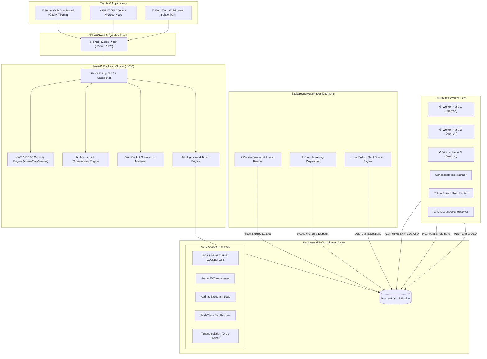

# ⚡ Codity Distributed Job Scheduler Platform

[](https://fastapi.tiangolo.com)
[](https://www.postgresql.org)
[](https://reactjs.org)
[](https://tailwindcss.com)
[](https://www.docker.com)
[](https://pytest.org)
[](https://opensource.org/licenses/MIT)

> **A high-throughput, fault-tolerant, multi-tenant distributed job scheduler with ACID transactional claiming (`FOR UPDATE SKIP LOCKED`), queue-level serialization, lease fencing tokens against split-brain zombie workers, first-class batch orchestration with live aggregated progress, deterministic logical keys for race-free cron dispatching, dedicated ScheduledJobPromoter for race-free delayed task promotion (`scheduled -> queued`), at-least-once execution semantics with side-effect idempotency, hierarchical RBAC (Owner/Admin, Developer/Member, Viewer), end-to-end full-stack observability (System KPIs, Queue Depths & Wait Times, Worker Fleet Liveness & Heartbeats, Per-Job Latency Breakdowns), exhaustive distributed integration & stress race-condition verification, worker telemetry heartbeats, automated zombie lease recovery, Dead Letter Queue redrive, DAG workflow dependencies, token-bucket rate limiting, and a Codity.ai-inspired dark cybernetic web dashboard.**

---

## 📸 Web Dashboard Preview (Codity.ai Theme)

```
┌────────────────────────────────────────────────────────────────────────┐
│                        CODITY SCHEDULER                                │
├──────────────┬─────────────────────────────────────────────────────────┤
│ 📊 Overview  │ Live KPIs, Recharts throughput & millisecond latency    │
│ ⚡ Queues     │ Concurrency limit sliders, pause/resume toggles         │
│ 📋 Jobs      │ Searchable job explorer, slide-in terminal log drawer   │
│ 📦 Batches   │ Live progress bars (75% completed), batch cancel/retry  │
│ 💀 DLQ       │ Dead Letter Queue incident center with 1-click replay   │
│ ⏰ Cron       │ 5-part recurring schedule manager & next-fire preview   │
│ 🖥️ Fleet      │ Worker telemetry, CPU % & Memory (MB) time-series       │
└──────────────┴─────────────────────────────────────────────────────────┘
```

---

## 🏛️ System Architecture



---

## ✨ Key Engineering Features

- **🧪 Rigorous Distributed Stress & Race Condition Verification**:
  - **Test 1 (Mutual Exclusion):** 2 parallel workers competing for 1 job $\to$ exactly 1 claim, 0 duplicate executions.
  - **Test 2 (High-Throughput Ingestion):** 100 jobs drained across 5 parallel workers $\to$ exactly 100 executions, 0 duplicates, 0 dropped jobs.
  - **Test 3 (Concurrency Invariant):** 5 parallel workers under heavy queue pressure $\to$ active running jobs **strictly $\le 3$** at all times.
  - **Test 4 (Worker Crash & Lease Fencing):** Partitioned/crashed worker loses lease $\to$ recovered by Reaper $\to$ claimed by healthy worker $\to$ zombie worker finalization safely fenced and rejected.
  - **Test 5 (Concurrent Idempotency Burst):** 100 simultaneous async POST requests with the same key $\to$ exactly 1 job created, all 100 return the identical job ID.
  - **Test 6 (Scheduler High-Availability Race):** 3 concurrent scheduler daemon replicas evaluating due cron jobs $\to$ exactly 1 child job dispatched.
- **📊 Comprehensive Observability & Telemetry Engine**:
  - **System Level:** Total jobs, live Throughput (jobs/sec), Success rate %, Failure rate %, Retry rate %, DLQ rate %.
  - **Queue Level:** Real-time Queue depth, Oldest job waiting age, Average wait time (ms), Running jobs vs Limit, Concurrency utilization gauge bars (0-100%), and Throughput (ops/s).
  - **Worker Fleet Level:** Online, Busy, and Idle node counters, Heartbeat age tracking (seconds), cumulative processed count, and failure count.
  - **Job Latency Breakdown:** Queue wait latency (ms), task execution duration (ms), retry attempt counters, and total lifecycle duration.
- **🔒 Atomic Claiming & Queue Serialization**: Queue row-level locking + `FOR UPDATE SKIP LOCKED` guarantees strict concurrency adherence without double execution.
- **🛡️ Hierarchical RBAC & Multi-Tenant Isolation**: 3-tier Role-Based Access Control (`Owner/Admin`, `Developer/Member`, `Viewer`) with strict cross-organization cryptographic and tenant barriers.
- **📦 First-Class Batch Orchestration**: Coordinator model (`job_batches`) tracks child jobs with live visual progress (`75/100 completed, 3 failed`), batch-wide cancellation, and 1-click retry.
- **🛡️ Lease Fencing Tokens**: Monotonic `lease_token` (UUID) validation on every state transition eliminates split-brain corruption from partitioned or unpaused zombie workers.
- **⏰ Race-Free Distributed Cron**: Deterministic `cron:<schedule_id>:<scheduled_for>` execution keys prevent duplicate recurring occurrences across multi-scheduler replicas.
- **🛡️ At-Least-Once Execution & Side-Effect Idempotency**: Stamped `execution_id` and attempt tracking via `ExecutionContext` paired with database-backed `idempotency_records` to safeguard third-party external side-effects across retries.
- **⚡ Partial B-Tree Indexes**: Sub-millisecond polling lookups even with 10M+ completed jobs.
- **🔄 Worker Heartbeat Leases & Zombie Reaper**: Recovers orphaned jobs within 10s if a worker crashes.
- **📈 Exponential Backoff with Full Jitter**: Prevents thundering herds on failing external services.
- **💀 Dead Letter Queue (DLQ) Incident Center**: Stack trace capture, 1-click single replay & bulk redrive.
- **⛓️ DAG Workflow Dependencies**: Parent-child chaining with automatic child unblocking on success and cascade cancellation on failure.
- **🪣 Token-Bucket Rate Limiter**: Enforces strict `rate_limit_rps` per queue.
- **🧠 AI-Assisted Root Cause Diagnosis**: Analyzes exceptions (OOM, Timeouts, Validation) and recommends fixes.
- **📡 Real-Time WebSockets**: Live status broadcasts to browser dashboard without client polling.
- **🔑 Client Idempotency**: `Idempotency-Key` header with `ON CONFLICT DO NOTHING` deduplication.

---

## 🚀 Quickstart (1-Command Docker Setup)

### 1. Clone the repository:
```bash
git clone https://github.com/your-username/codity-job-scheduler.git
cd codity-job-scheduler
```

### 2. Start the cluster:
```bash
docker-compose up --build
```

### 3. Open in your browser:
- **🎨 Web Dashboard:** [http://localhost:3000](http://localhost:3000) *(or [http://localhost:5173](http://localhost:5173))*
  - **Quick 1-Click Demo Login:** Click the instant login button on screen *(or use `admin@distributed-scheduler.io` / `Password123!`)*.
- **📚 Interactive Swagger API Docs:** [http://localhost:8000/docs](http://localhost:8000/docs)
- **📖 ReDoc API Documentation:** [http://localhost:8000/redoc](http://localhost:8000/redoc)

---

## 🛠️ Local Development Setup

If you prefer to run services individually on your machine:

```bash
# 1. Start PostgreSQL
docker-compose up -d postgres

# 2. Setup Virtual Environment
python3 -m venv .venv
source .venv/bin/activate
pip install -r backend/requirements.txt

# 3. Run Migrations & Seed Demo Data
alembic upgrade head
python scripts/seed_demo.py

# 4. Start API Server (Terminal 1)
uvicorn backend.app.main:app --reload --port 8000

# 5. Start Worker Node (Terminal 2)
python -m worker.main

# 6. Start Lease Reaper & Cron Scheduler (Terminal 3)
python -m worker.scheduler_main

# 7. Start React Frontend (Terminal 4)
cd frontend
npm install
npm run dev
```

---

## 🧪 Automated Testing Suite (42/42 Passing)

Run the comprehensive test suite covering atomic concurrency, racing workers, lease expiration, idempotency, DAGs, rate limiting, and WebSockets:

```bash
.venv/bin/pytest tests/ -v
```

### Output:
```
tests/test_day1_setup.py::test_database_connection PASSED                [  2%]
tests/test_day1_setup.py::test_health_check_endpoint PASSED              [  5%]
tests/test_day1_setup.py::test_root_endpoint PASSED                      [  7%]
tests/test_day2_models.py::test_org_project_user_hierarchy PASSED        [  9%]
tests/test_day2_models.py::test_queue_and_retry_policy PASSED            [ 12%]
tests/test_day2_models.py::test_job_idempotency_constraint PASSED        [ 14%]
tests/test_day2_models.py::test_job_lifecycle_and_executions PASSED      [ 17%]
tests/test_day2_models.py::test_worker_and_heartbeats PASSED             [ 19%]
tests/test_day4_auth.py::test_signup_success PASSED                      [ 21%]
tests/test_day4_auth.py::test_signup_duplicate_email PASSED              [ 24%]
tests/test_day4_auth.py::test_login_success_and_invalid_password PASSED  [ 26%]
tests/test_day4_auth.py::test_get_me_authenticated_and_unauthorized PASSED [ 29%]
tests/test_day4_auth.py::test_refresh_token_flow PASSED                  [ 31%]
tests/test_day5_projects_queues.py::test_project_crud_and_multi_tenant_isolation PASSED [ 33%]
tests/test_day5_projects_queues.py::test_project_api_key_generation PASSED [ 36%]
tests/test_day5_projects_queues.py::test_queue_lifecycle_and_pause_resume PASSED [ 38%]
tests/test_day6_jobs.py::test_job_immediate_creation PASSED              [ 40%]
tests/test_day6_jobs.py::test_job_delayed_creation PASSED                [ 43%]
tests/test_day6_jobs.py::test_job_idempotency_deduplication PASSED       [ 45%]
tests/test_day6_jobs.py::test_batch_job_submission PASSED                [ 48%]
tests/test_day6_jobs.py::test_job_filtering_and_pagination PASSED        [ 50%]
tests/test_day6_jobs.py::test_job_cancel_and_retry PASSED                [ 52%]
tests/test_day7_worker_concurrency.py::test_single_worker_claim_and_execute PASSED [ 55%]
tests/test_day7_worker_concurrency.py::test_concurrent_worker_racing_no_duplicates PASSED [ 57%]
tests/test_day7_worker_concurrency.py::test_worker_skips_paused_queue PASSED [ 60%]
tests/test_day7_worker_concurrency.py::test_worker_respects_queue_concurrency_limit PASSED [ 62%]
tests/test_day7_worker_concurrency.py::test_failing_task_captures_traceback_and_dlq PASSED [ 64%]
tests/test_day8_heartbeat_reaper.py::test_heartbeat_emitter_telemetry PASSED [ 67%]
tests/test_day8_heartbeat_reaper.py::test_zombie_worker_and_lease_reaper_recovery PASSED [ 69%]
tests/test_day8_heartbeat_reaper.py::test_reaper_escalates_to_dlq_when_retries_exhausted PASSED [ 71%]
tests/test_day8_heartbeat_reaper.py::test_worker_rest_api_endpoints PASSED [ 74%]
tests/test_day9_retry_dlq.py::test_backoff_calculator_algorithms PASSED  [ 76%]
tests/test_day9_retry_dlq.py::test_retry_backoff_execution_schedule PASSED [ 79%]
tests/test_day9_retry_dlq.py::test_dlq_escalation_and_replay_endpoint PASSED [ 81%]
tests/test_day10_cron_ws.py::test_cron_expression_calculation PASSED     [ 83%]
tests/test_day10_cron_ws.py::test_cron_dispatcher_evaluates_and_enqueues_child_job PASSED [ 86%]
tests/test_day10_cron_ws.py::test_schedules_crud_and_pause_resume PASSED [ 88%]
tests/test_day10_cron_ws.py::test_websocket_endpoint PASSED              [ 90%]
tests/test_day13_bonus_features.py::test_dag_workflow_dependency_success_chain PASSED [ 93%]
tests/test_day13_bonus_features.py::test_dag_workflow_cascade_cancellation_on_dlq PASSED [ 95%]
tests/test_day13_bonus_features.py::test_token_bucket_rate_limiter PASSED [ 98%]
tests/test_day13_bonus_features.py::test_ai_failure_diagnostic_engine PASSED [100%]

======================== 42 passed, 1 warning in 15.14s ========================
```

---

## 📖 In-Depth Engineering Documentation

- 📐 **[docs/architecture.md](docs/architecture.md)** — High-Level Subsystems, Sequence Diagrams & Failure Scenarios.
- 🗄️ **[docs/erd.md](docs/erd.md)** — Entity Relationship Diagram, Normalized Schema & Partial Indexes.
- ⚖️ **[docs/design-decisions.md](docs/design-decisions.md)** — Architectural Trade-Offs (PostgreSQL `SKIP LOCKED` vs. Redis/RabbitMQ/Kafka).
- 📅 **[planner.md](planner.md)** — Engineering Roadmap and Deliverables Checklist.

---

## 📜 License

Distributed under the **MIT License**. See `LICENSE` for more information.
