# System Architecture & Technical Specification

## 1. High-Level Architecture Overview

The **Codity Distributed Job Scheduler** is a production-grade, multi-tenant distributed task execution platform designed for high-throughput, low-latency background job processing with ACID reliability guarantees.

```mermaid
flowchart TB
    %% ================= GLOBAL STYLING =================
    classDef clientStyle fill:#0B132B,stroke:#00E5FF,stroke-width:2px,color:#E2E8F0,font-weight:bold;
    classDef gatewayStyle fill:#0F172A,stroke:#38BDF8,stroke-width:2px,color:#E2E8F0,font-weight:bold;
    classDef apiStyle fill:#1E1B4B,stroke:#818CF8,stroke-width:2px,color:#E2E8F0,font-weight:bold;
    classDef pgStyle fill:#064E3B,stroke:#10B981,stroke-width:2px,color:#E2E8F0,font-weight:bold;
    classDef workerStyle fill:#312E81,stroke:#C084FC,stroke-width:2px,color:#E2E8F0,font-weight:bold;
    classDef daemonStyle fill:#4C0519,stroke:#FB7185,stroke-width:2px,color:#E2E8F0,font-weight:bold;
    classDef featureStyle fill:#022C22,stroke:#34D399,stroke-width:1px,color:#A7F3D0;

    %% ================= TIER 1: CLIENTS =================
    subgraph TIER1["🎨 1. CLIENT & CONSUMER LAYER"]
        Browser["💻 React 19 Dashboard<br/><i>(Live Telemetry & Controls)</i>"]:::clientStyle
        Microservices["⚡ External Microservices<br/><i>(REST Ingestion)</i>"]:::clientStyle
        WSSubscribers["📡 WebSocket Subscribers<br/><i>(Live Event Feed)</i>"]:::clientStyle
    end

    %% ================= TIER 2: GATEWAY =================
    subgraph TIER2["🌐 2. INGRESS & REVERSE PROXY LAYER"]
        Nginx["🛡️ Nginx Reverse Proxy (:3000 / :5173 / :80)<br/><i>HTTP/1.1 & WebSocket Upgrade Passthrough</i>"]:::gatewayStyle
    end

    %% ================= TIER 3: CONTROL PLANE =================
    subgraph TIER3["⚡ 3. API CONTROL PLANE (FastAPI Cluster :8000)"]
        API["🚀 FastAPI Async REST Router"]:::apiStyle
        AuthModule["🔒 JWT & RBAC Engine<br/><i>(Admin / Dev / Viewer)</i>"]:::apiStyle
        WSManager["📡 WebSocket Broadcast Hub"]:::apiStyle
        Telemetry["📊 Telemetry & KPI Engine"]:::apiStyle
    end

    %% ================= TIER 4: PERSISTENCE LAYER =================
    subgraph TIER4["🗄️ 4. ACID PERSISTENCE & COORDINATION CORE (PostgreSQL 16)"]
        Postgres[("🐘 PostgreSQL 16 ACID Engine")]:::pgStyle
        subgraph PGFeatures["Transactional Primitives & Structures"]
            SkipLocked["⚡ FOR UPDATE SKIP LOCKED<br/><i>(Zero-Collision Atomic Claiming)</i>"]:::featureStyle
            Fencing["🛡️ Monotonic Lease Fencing<br/><i>(Zombie Protection)</i>"]:::featureStyle
            Batches["📦 Batch Coordinator<br/><i>(Live Progress Aggregation)</i>"]:::featureStyle
            PartialIdx["⚡ Partial B-Tree Indexes<br/><i>(Sub-ms Status Lookups)</i>"]:::featureStyle
            Idemp["🔑 Idempotency Store<br/><i>(Deduplication Records)</i>"]:::featureStyle
        end
    end

    %% ================= TIER 5: WORKER FLEET =================
    subgraph TIER5["⚙️ 5. DISTRIBUTED DATA PLANE (Worker Node Fleet)"]
        Worker1["Node 1 Daemon"]:::workerStyle
        Worker2["Node 2 Daemon"]:::workerStyle
        WorkerN["Node N Daemon"]:::workerStyle
        
        Runner["📦 Sandboxed Task Runner"]:::workerStyle
        RateLimiter["🪣 Token-Bucket Rate Limiter"]:::workerStyle
        DAG["⛓️ DAG Dependency Cascade"]:::workerStyle
    end

    %% ================= TIER 6: BACKGROUND DAEMONS =================
    subgraph TIER6["🤖 6. AUTONOMOUS BACKGROUND DAEMONS"]
        Promoter["🕒 ScheduledJobPromoter<br/><i>(Atomic delayed ➔ queued promotion)</i>"]:::daemonStyle
        Reaper["💀 Lease Reaper<br/><i>(Dead worker recovery & requeue)</i>"]:::daemonStyle
        CronDispatcher["⏰ Cron Dispatcher<br/><i>(Deterministic 5-part cron evaluator)</i>"]:::daemonStyle
        AIDiagnostics["🧠 AI Diagnostics<br/><i>(Google Gemini / OpenAI LLM RCA)</i>"]:::daemonStyle
    end

    %% ================= DATA FLOW CONNECTIONS =================
    Browser -->|HTTP / JSON| Nginx
    Microservices -->|REST API Requests| Nginx
    WSSubscribers <-->|WSS: Connection Upgrade| Nginx

    Nginx -->|Route /api/| API
    Nginx <-->|Route /api/v1/ws| WSManager

    API --> AuthModule
    API --> WSManager
    API --> Telemetry
    API -->|asyncpg Connection Pool| Postgres

    Worker1 & Worker2 & WorkerN -->|1. Atomic Poll FOR UPDATE SKIP LOCKED| Postgres
    Worker1 & Worker2 & WorkerN -->|2. Heartbeat Telemetry & Lease Renewal| Postgres
    Worker1 & Worker2 & WorkerN -->|3. Record Executions, Logs & DLQ| Postgres

    Runner --- Worker1 & Worker2 & WorkerN
    RateLimiter --- Runner
    DAG --- Runner

    Promoter -->|Promote Due Scheduled Tasks| Postgres
    Reaper -->|Scan Expired Leases & Reclaim| Postgres
    CronDispatcher -->|Dispatch Idempotent Recurring Jobs| Postgres
    AIDiagnostics -->|Analyze Stack Traces on DLQ| Postgres
```

---

## 2. Core Subsystems

### 2.1 Atomic Claiming Engine (`FOR UPDATE SKIP LOCKED`)
Workers poll for ready jobs using an atomic Common Table Expression (CTE) query:
- Filters for `status = 'queued'`, `run_at <= NOW()`, and `queue.is_paused = FALSE`.
- Enforces queue-level `concurrency_limit` by counting in-flight jobs.
- Evaluates queue priority (`priority DESC`) and task submission time (`run_at ASC`).
- Uses `FOR UPDATE SKIP LOCKED` so concurrent worker nodes never lock each other or claim duplicate records.

### 2.2 Worker Fleet Telemetry & Lease Heartbeats
- Each worker instance registers in `workers` table and spawns an asynchronous background heartbeat emitter loop (every 5 seconds).
- Emits real-time CPU % and Memory (MB) consumption metrics.
- Automatically renews `lock_expires_at` leases for in-flight tasks to prevent premature reaper reclamation.

### 2.3 Zombie Worker & Expired Lease Reaper
- Detects worker instances whose heartbeat is older than threshold (30s) and marks them `DEAD`.
- Reclaims orphaned in-flight jobs:
  - If `attempt_count < max_retries`: resets status to `'queued'` for healthy workers to pick up.
  - If retries exhausted: routes directly to `dead_letter_queue`.

### 2.4 Retry Backoff Engine with Full Jitter
Computes backoff interval using AWS-style Full Jitter:
$$\text{Delay} = \text{random}(0, \min(\text{max\_interval}, \text{initial\_interval} \times \text{multiplier}^{\text{attempt}}))$$

### 2.5 DAG Workflow Dependency Engine
- Tasks can declare `parent_job_id` dependencies.
- Dependent child tasks wait in `SCHEDULED` status until the parent succeeds.
- When parent succeeds, downstream child jobs are automatically unblocked to `QUEUED` status with `run_at = NOW()`.
- If parent fails permanently into DLQ, child tasks are automatically marked `CANCELLED`.

### 2.6 Token-Bucket Rate Limiter per Queue
- Queues support `rate_limit_rps` (requests per second).
- Thread-safe async token bucket guarantees strict throughput caps during atomic claiming.

### 2.7 AI-Assisted DLQ Root Cause Analysis
- Automatically parses exception type, traceback, and input arguments.
- Categorizes failure (Memory OOM, Network Timeout, Schema Validation, Auth Rejection, Database Deadlock).
- Provides actionable remediation and `Safe to Replay` indicators.

### 2.8 Execution Guarantees & Side-Effect Idempotency
- **System Guarantee:** At-least-once execution with idempotent job submission and lease-based crash recovery.
- **Execution Context:** Every execution instance is injected with a unique `execution_id` (UUID) and explicit `attempt_number` via `ExecutionContext`.
- **Side-Effect Idempotency Protocol:** External operations (e.g. payment gateway charges, third-party API mutations, webhook calls) use the built-in `execute_idempotent_operation` helper which persists `job_id + operation` records in `idempotency_records` to guarantee zero duplicate external side-effects across retry attempts.

### 2.9 Lease Fencing Tokens & Split-Brain Immunity
- **Fencing Token Generation:** Each claim sets a unique `lease_token` (UUID) on the job row.
- **Fenced Finalization:** Finalization updates require `WHERE id = :id AND lease_token = :held_token AND status = 'running'`.
- **Split-Brain Defense:** If a partitioned or paused zombie worker wakes up after its lease expired and was reclaimed by a new worker, its finalization matches 0 rows and is rejected without corrupting active job state.

### 2.10 Deterministic Cron Execution Keys
- **Deterministic Key Format:** `cron:<schedule_id>:<scheduled_for_iso>`.
- **Duplicate Prevention:** Combines with PostgreSQL's partial unique index on `(queue_id, idempotency_key)` and `ON CONFLICT DO NOTHING`.
- **Multi-Scheduler Safety:** High-availability scheduler daemon replicas can concurrently evaluate schedules without double-dispatching occurrences.

### 2.11 First-Class Batch Orchestration
- **Model Hierarchy:** Dedicated `job_batches` coordinator with child jobs linked via `jobs.batch_id`.
- **Parallel Dispatch:** Workers claim individual batch child jobs concurrently under ACID SKIP LOCKED primitives.
- **Aggregated Telemetry:** Real-time counters (`total_jobs`, `completed_jobs`, `failed_jobs`, `cancelled_jobs`, `progress_percent`).
- **Batch Control APIs:** Atomic multi-job creation (`POST /api/v1/queues/{id}/batches`), live progress inspection, batch cancellation, and retry redrive.

### 2.12 Hierarchical Role-Based Access Control (RBAC) & Multi-Tenant Security
- **3-Tier Permission Matrix:**
  - `Owner / Admin`: Full administrative control across organizations, projects, queues, workers, API keys, and jobs.
  - `Developer / Member`: Job lifecycle operations (submit, batch enqueue, cancel, retry, DLQ replay, recurring schedules). Administrative mutations forbidden (`403 Forbidden`).
  - `Viewer`: Read-only telemetry and monitoring. All mutation endpoints return `403 Forbidden`.
- **Cross-Tenant Isolation Barrier:** Every SQL query joins against `Project` and validates `Project.org_id == current_user.org_id`. Requests targeting unauthorized foreign UUIDs return `404 Not Found` without information leakage.

### 2.13 End-to-End Multi-Tier Observability & Latency Telemetry
- **System KPIs:** Live jobs/sec throughput, real-time success rate %, failure rate %, retry backoff rate %, and DLQ escalation rate %.
- **Queue Saturation:** Instantaneous queue depth, oldest job wait age, average latency from creation to execution start (ms), and concurrency utilization percentage gauge (0-100%).
- **Worker Fleet Health:** Online/busy/idle node tracking, live heartbeat age (seconds), cumulative execution counts, and node failure telemetry.
- **Per-Job Lifecycle Latency Breakdown:** Exact queue wait time (ms), task execution duration (ms), retry attempt counters, and total lifecycle duration.

### 2.14 Distributed Race Condition & Stress Verification Harness
- **Mutual Exclusion (2 Workers, 1 Job):** Validates PostgreSQL `FOR UPDATE SKIP LOCKED` guarantees exactly 1 worker claims and completes the job.
- **Distributed Ingestion (100 Jobs, 5 Workers):** Verifies zero duplicate claims, 100 executions, and 0 dropped jobs under parallel fleet load.
- **Strict Concurrency Invariant ($\text{Running} \le C$):** Asynchronous observer polls at 5ms intervals to mathematically verify active in-flight executions never violate queue concurrency caps.
- **Worker Crash & Split-Brain Fencing:** Confirms Lease Reaper recovers orphaned jobs, issues a new `lease_token`, and aborts/kills stale finalization attempts from revived zombie workers.
- **Concurrent Idempotency Burst:** 100 parallel asynchronous `POST` requests resolve to exactly 1 database row and return identical responses.
- **High-Availability Cron Scheduler Race:** Multiple concurrent Cron Dispatcher daemon replicas evaluate due schedules with zero duplicate child job occurrences.

