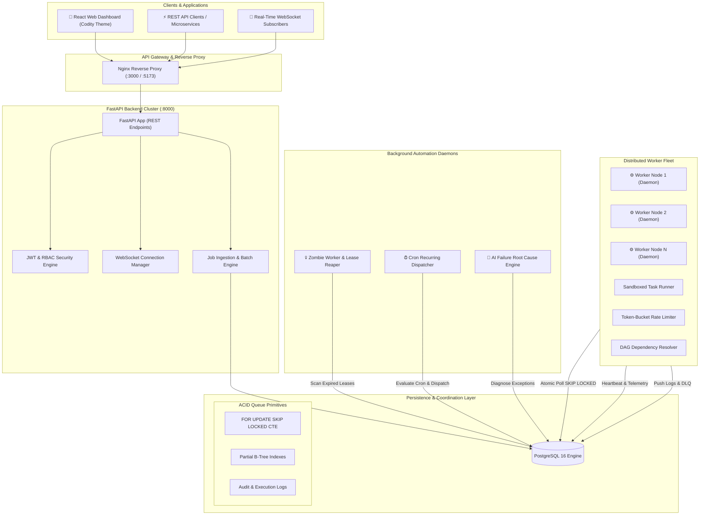

# System Architecture & Technical Specification

## 1. High-Level Architecture Overview

The **Codity Distributed Job Scheduler** is a production-grade, multi-tenant distributed task execution platform designed for high-throughput, low-latency background job processing with ACID reliability guarantees.

---

## 2. Core Subsystems

### 2.1 Atomic Claiming Engine (`FOR UPDATE SKIP LOCKED`)
Workers poll for ready jobs using an atomic Common Table Expression (CTE) query:
- Filters for `status = 'queued'`, `run_at <= NOW()`, and `queue.is_paused = FALSE`.
- Enforces queue-level `concurrency_limit` by counting in-flight jobs.
- Evaluates queue priority (`priority DESC`) and task submission time (`run_at ASC`).
- Uses `FOR UPDATE SKIP LOCKED` so concurrent worker nodes never lock each other or claim duplicate records.

### 2.2 Worker Fleet Telemetry & Lease Heartbeats
- Each worker instance registers in `workers` table and spawns an asynchronous background heartbeat emitter loop (every 5 seconds).
- Emits real-time CPU % and Memory (MB) consumption metrics.
- Automatically renews `lock_expires_at` leases for in-flight tasks to prevent premature reaper reclamation.

### 2.3 Zombie Worker & Expired Lease Reaper
- Detects worker instances whose heartbeat is older than threshold (30s) and marks them `DEAD`.
- Reclaims orphaned in-flight jobs:
  - If `attempt_count < max_retries`: resets status to `'queued'` for healthy workers to pick up.
  - If retries exhausted: routes directly to `dead_letter_queue`.

### 2.4 Retry Backoff Engine with Full Jitter
Computes backoff interval using AWS-style Full Jitter:
$$\text{Delay} = \text{random}(0, \min(\text{max\_interval}, \text{initial\_interval} \times \text{multiplier}^{\text{attempt}}))$$

### 2.5 DAG Workflow Dependency Engine
- Tasks can declare `parent_job_id` dependencies.
- Dependent child tasks wait in `SCHEDULED` status until the parent succeeds.
- When parent succeeds, downstream child jobs are automatically unblocked to `QUEUED` status with `run_at = NOW()`.
- If parent fails permanently into DLQ, child tasks are automatically marked `CANCELLED`.

### 2.6 Token-Bucket Rate Limiter per Queue
- Queues support `rate_limit_rps` (requests per second).
- Thread-safe async token bucket guarantees strict throughput caps during atomic claiming.

### 2.7 AI-Assisted DLQ Root Cause Analysis
- Automatically parses exception type, traceback, and input arguments.
- Categorizes failure (Memory OOM, Network Timeout, Schema Validation, Auth Rejection, Database Deadlock).
- Provides actionable remediation and `Safe to Replay` indicators.

### 2.8 Execution Guarantees & Side-Effect Idempotency
- **System Guarantee:** At-least-once execution with idempotent job submission and lease-based crash recovery.
- **Execution Context:** Every execution instance is injected with a unique `execution_id` (UUID) and explicit `attempt_number` via `ExecutionContext`.
- **Side-Effect Idempotency Protocol:** External operations (e.g. payment gateway charges, third-party API mutations, webhook calls) use the built-in `execute_idempotent_operation` helper which persists `job_id + operation` records in `idempotency_records` to guarantee zero duplicate external side-effects across retry attempts.

### 2.9 Lease Fencing Tokens & Split-Brain Immunity
- **Fencing Token Generation:** Each claim sets a unique `lease_token` (UUID) on the job row.
- **Fenced Finalization:** Finalization updates require `WHERE id = :id AND lease_token = :held_token AND status = 'running'`.
- **Split-Brain Defense:** If a partitioned or paused zombie worker wakes up after its lease expired and was reclaimed by a new worker, its finalization matches 0 rows and is rejected without corrupting active job state.

