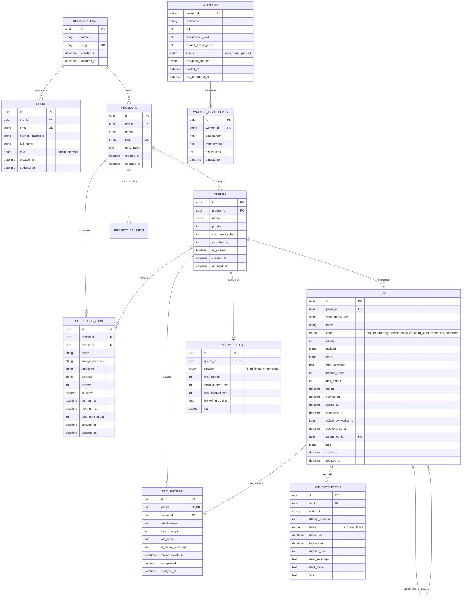

# Database Schema & Entity Relationship Diagram (ERD)

## 1. Entity Relationship Diagram (Mermaid)

---

## 2. Partial Performance Indexes

1. **`idx_jobs_claim_ready`**:
   - `ON jobs (queue_id, priority DESC, run_at ASC) WHERE status = 'queued'`
   - Accelerates `FOR UPDATE SKIP LOCKED` atomic worker claims to sub-millisecond lookups.
2. **`idx_jobs_running_lease`**:
   - `ON jobs (lock_expires_at) WHERE status = 'running'`
   - Enables instant zombie reaper detection of expired leases without scanning completed jobs.
3. **`idx_jobs_idempotency`**:
   - `ON jobs (queue_id, idempotency_key) UNIQUE WHERE idempotency_key IS NOT NULL`
   - Guarantees zero-duplicate job insertion on concurrent client retries.
